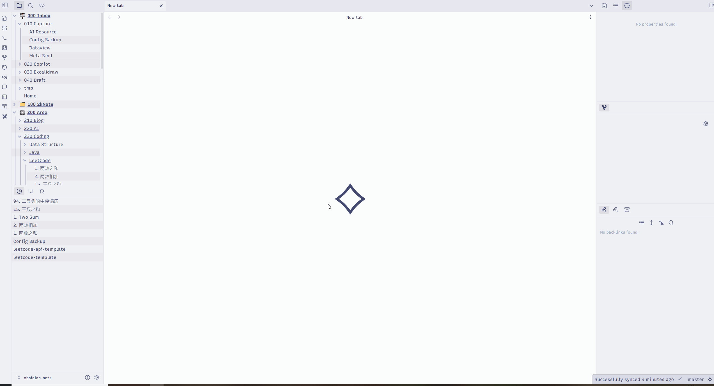

# leetcode-api
LeetCode Problem Fetcher API for Obsidian.

## Demo 🎬

## Features ✨

- Fetch specific LeetCode problems by url or slug.
- Fetch daily LeetCode problems.
- [TODO] Other apis.

## Usage 📝

1. Clone the repository.
2. Install the dependencies with `pip install -r requirements.txt`.
3. Run `python run.py`.

## Endpoints 🚀

> Get full list of endpoints via `/docs`.

| Endpoint          | Method | Description                             |
| ----------------- | ------ | --------------------------------------- |
| `/problem/select` | GET    | Get details about a spiecific question. | 
| `/problem/daily`  | GET    | Get the daily question.                 |
